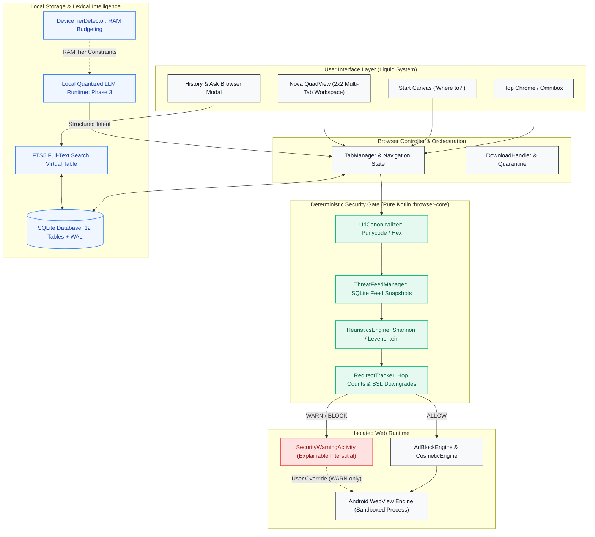

# NovaBrowser

> A security-first, local-first browser architecture for Android that keeps users safer by default, delivers multi-tab spatial productivity with Nova QuadView, and enables on-device contextual retrieval without cloud dependency.

[-3DDC84?logo=android&logoColor=white)](#tech-stack)
[](#tech-stack)
[](#data-model--database-er-diagram)
[-10B981)](#deterministic-security-gate)
[%20Offline%20Engine-06B6D4)](#network-ad--tracker-blocking-engine)
[-FF6B6B)](#nova-quadview-spatial-workspace)
[](#test-suite--verification)
[](#target-performance-metrics)

<p align="center">
  
</p>

---

## Current Project Status

| Maturity | System / Subsystem | Implementation Reality |
| :--- | :--- | :--- |
| **IMPLEMENTED** | **Core Browser Shell** | Android WebView harness, `MainActivity`, `TabManager`, multi-tab lifecycle, session restore, omnibox suggestions, dark mode, reader mode, PWA shortcuts. |
| **IMPLEMENTED** | **Nova QuadView** | Up to 4 live tabs in a responsive 2×2 grid or Focus Mode. Seamless `NovaWebView` reparenting (*"Layout change != session recreation"*). |
| **IMPLEMENTED** | **Deterministic Security Gate** | Pure Kotlin gate in `:browser-core`. Punycode/IDN canonicalizer, local URLhaus malware lookup (5,057+ domains), Shannon entropy, Levenshtein homoglyphs, 4-hop redirect limits, explainable warning UI. Operates 100% offline ($\le 3\text{ ms}$). |
| **IMPLEMENTED** | **Ad, Tracker & Privacy Shields** | Fast-path subresource filtering in $O(\text{labels})$ lookup time (9,578 EasyList/EasyPrivacy rules), 118 cosmetic CSS selectors, Brave-style per-site shields (`site_shields_settings`), third-party cookie blocking, DNT/Sec-GPC headers. |
| **IMPLEMENTED** | **Download Quarantine Sandbox** | Risky executables (`.apk`, `.dex`, `.sh`, `.exe`) routed to app-private `.nova_quarantine/` with streaming SHA-256 integrity verification and explicit user release dialog. |
| **IMPLEMENTED** | **History & Lexical Retrieval** | SQLite `history` and `history_fts` with BM25 prefix token matching (`"word"*`) + `LIKE` fallback. Filter chips for Today, Yesterday, Security, and Bookmarks. |
| **IMPLEMENTED** | **Private Browsing Isolation** | Zero SQLite writes, cache suppression (`LOAD_NO_CACHE`), cookie flushing on tab closure, biometric fingerprint/face authentication lock. |
| **PARTIAL** | **Local AI Engine** | Hardware device RAM tiering implemented (`DeviceTierDetector`: Minimal $\le 2\text{GB}$, Light $3\text{--}4\text{GB}$, Standard $\ge 6\text{GB}$). Architecture contract stub (`AiEngine`) is dormant to guarantee zero idle RAM overhead. |
| **PARTIAL** | **History Search 2.0** | Lexical FTS5 token search with BM25 ranking is live; arbitrary natural-language temporal parsing (e.g. *"github docs from last Tuesday"*) is in progress. |
| **PLANNED** | **On-Device LLM Runtime** | Embedded `llama.cpp` NDK bindings with quantized GGUF model execution (Phase 3 Roadmap). |
| **PLANNED** | **Vector Embeddings Index** | SQLite `ai_page_index` embedding vectors for local semantic retrieval (Phase 3 Roadmap). |
| **PLANNED** | **Desktop Application** | Electron / Chromium desktop port sharing the deterministic security core (Phase 5 Roadmap). |
| **PLANNED** | **Encrypted Sync** | Zero-knowledge end-to-end encrypted cross-device sync (Phase 6 Roadmap). |

---

## Table of Contents

- [Overview](#overview)
- [Visual Canvases & Interface Showcase](#visual-canvases--interface-showcase)
- [Nova QuadView: Spatial Workspace](#nova-quadview-spatial-workspace)
- [Core Architectural Pillars](#core-architectural-pillars)
- [System Architecture](#system-architecture)
- [Deterministic Security Gate](#deterministic-security-gate)
- [Network Ad & Tracker Blocking Engine](#network-ad--tracker-blocking-engine)
- [Download Security & Quarantine Sandbox](#download-security--quarantine-sandbox)
- [History Search & Retrieval Engine](#history-search--retrieval-engine)
- [Local-First AI & Memory Management](#local-first-ai--memory-management)
- [Data Model & Database ER Diagram](#data-model--database-er-diagram)
- [Repository & Module Structure](#repository--module-structure)
- [Tech Stack](#tech-stack)
- [Build & Verification](#build--verification)
- [Target Performance Metrics](#target-performance-metrics)
- [Security Boundaries & Explicit Limitations](#security-boundaries--explicit-limitations)
- [Roadmap & Milestones](#roadmap--milestones)
- [Companion Specifications](#companion-specifications)

---

## Overview

**NovaBrowser** is an Android web browser engineered around two foundational premises: **deterministic offline security** and **sovereign local intelligence**.

Rather than delegating browsing safety to non-deterministic Large Language Models (LLMs) or latency-heavy cloud lookups, NovaBrowser intercepts navigations and subresources through an offline, rule-based Security Gate written in Kotlin. Navigations are canonicalized, matched against local cryptographic snapshots of threat databases, evaluated with entropy/Levenshtein heuristics, and scrutinized for redirect loops before network transmission occurs.

In parallel, user context—browsing history, saved sessions, downloads, and bookmarks—is indexed locally via SQLite and FTS5. On-device AI acts strictly as an analytical interface over this validated local index, never as an unconstrained execution authority.

---

## Visual Canvases & Interface Showcase

NovaBrowser implements the **Liquid System** visual specification: Apple-grade minimalism, restrained typography, squircle geometry, and a floating-island spatial layout.

### The 4 Core Canvases

| 1. Start Canvas ("Where to?") | 2. Live Browsing Canvas |
| :---: | :---: |
|  |  |
| **Start Canvas (`layoutNewTabCanvas`)**<br/>• Hero Nova Core Mark squircle with pulsing status beacon.<br/>• Active glass search omnibox with On-Device AI badge.<br/>• 8 App Haven tiles (GitHub, arXiv, Linear, Notion, Docs, Figma, etc.).<br/>• Contextual Jump-Back-In sessions card.<br/>• Bottom floating island with spatial navigation. | **Live Browsing View**<br/>• 2px emerald reading progress indicator.<br/>• Floating security domain anchor pill with lock glyph.<br/>• Dedicated non-overlapping WebView container (`paddingBottom="76dp"`).<br/>• Contextual bottom "Ask Browser" query pill.<br/>• Clean gesture-friendly navigation controls. |

| 3. Fast Lexical History Search | 4. Explainable Security Warning |
| :---: | :---: |
|  |  |
| **Lexical History Search (`HistoryActivity`)**<br/>• Fast full-text keyword search with instant local processing.<br/>• Categorization filter chips (All, Today, Yesterday, Security, Bookmarks).<br/>• Contextual retrieval powered by SQLite FTS5 BM25 ranking.<br/>• Offline BM25 lexical search (On-device LLM scheduled for Phase 3). | **Security Warning Screen (`SecurityWarningActivity`)**<br/>• Measured crimson optics with hazard shield.<br/>• Intercepted host card with real-time detection telemetry.<br/>• Hardware-verified threat breakdown (Homoglyph, Entropy).<br/>• Non-bypassable lock for verified URLhaus malware. |

---

## Nova QuadView: Spatial Workspace

**Nova QuadView** is NovaBrowser's flagship spatial multitasking innovation: **up to four live browser tabs inside one window — without recreating or reloading their sessions.**

```
┌────────────────────────────────────────────────────────┐
│               Nova QuadView Workspace                  │
│                                                        │
│   ┌────────────────────────┬────────────────────────┐  │
│   │ Slot A [ACTIVE]        │ Slot B                 │  │
│   │ Tab: "GitHub Repo"     │ Tab: "Android Docs"    │  │
│   │ [Live NovaWebView #1]  │ [Live NovaWebView #2]  │  │
│   ├────────────────────────┼────────────────────────┤  │
│   │ Slot C                 │ Slot D                 │  │
│   │ Tab: "StackOverflow"   │ Tab: "Terminal Logs"   │  │
│   │ [Live NovaWebView #3]  │ [Live NovaWebView #4]  │  │
│   └────────────────────────┴────────────────────────┘  │
└────────────────────────────────────────────────────────┘
```

### Architectural Highlights
- **"Layout Change $\neq$ Session Recreation":** QuadView is a presentation layer, not a separate browser engine. Live `NovaWebView` instances are dynamically reparented between the single-tab container and `QuadPaneView` slots without triggering page reloads, DOM resets, or JavaScript interruptions.
- **2×2 Responsive Grid:** Automatically balances layout weights across Portrait (two stacked rows) and Landscape (two side-by-side columns).
- **Focus Mode:** Double-tap or tap the expand icon to blow up any quad pane to 100% dominant view while keeping background sessions alive in dormant slots.
- **Pane Context Controls:** In-place tab reload, slot-to-slot swapping, tab replacement, and direct slot closure.
- **Privacy Boundary:** Standard tabs and private tabs cannot mix inside the same QuadView workspace.

---

## Core Architectural Pillars

### 1. Deterministic Security Core
**AI is NEVER the security authority.** Security decisions (`ALLOW`, `WARN`, `BLOCK`) are made exclusively by auditable, deterministic Kotlin routines evaluating offline threat feeds, homoglyph algorithms, and protocol topologies.

### 2. Local-First Contextual AI
On-device models (planned via `llama.cpp` and GGUF quantization) operate under a **Retrieval-Augmented Generation (RAG)** model over SQLite/FTS5. The model interprets intent and formats results; native code executes validated queries.

### 3. Anti-Bloat & Strict Resource Tiering
NovaBrowser uses the system-provided Android WebView to avoid the ~150MB overhead of shipping a standalone Chromium engine. Memory is strictly budgeted across defined hardware tiers, allowing graceful degradation on devices with as little as 2GB RAM.

---

## System Architecture

### High-Level Layer Architecture



---

## Deterministic Security Gate

The Security Gate rejects the assumption that an absence of threat data implies safety:

$$\text{Axiom: } \mathbf{UNKNOWN \neq SAFE}$$

### Security Gate Pipeline

When a URL is submitted by a user, an external app, or an AI tool call, it traverses a strict six-stage deterministic gate:

1. **URL Canonicalization:** Punycode conversion (`xn--...`), recursive percent-decoding, auth stripping, port normalization.
2. **Threat Feed Match:** Fast binary and hash lookup against offline URLhaus database (5,057+ malware domains).
3. **Statistical & Brand Heuristics:** Shannon entropy calculation for DGA detection and Levenshtein distance check against protected brand dictionaries (`paypa1.com` $\rightarrow$ `WARN`).
4. **Redirect Lineage:** Tracks full redirect chains, terminating loops exceeding 4 hops and catching SSL-stripping downgrades (`HTTPS -> HTTP`).
5. **Dual-Layer Interception:** `shouldOverrideUrlLoading` for navigations; `shouldInterceptRequest` for subresources.
6. **Web Sandbox Execution:** Clean navigations render inside Android's hardened WebView sandbox.

---

## Network Ad & Tracker Blocking Engine

NovaBrowser filters web surveillance locally without transmitting queries to remote resolvers:

- **Subresource Fast-Path Filter (`AdBlockEngine`):** Matches request URLs against an in-memory label tree of 9,578 domain rules in $O(\text{labels})$ lookup time ($\le 2\text{ ms}$).
- **Cosmetic Element Hiding (`CosmeticEngine`):** Automatically injects 118 batched CSS hiding rules on `onPageFinished` to collapse collapsed banner placeholders.
- **Site Shields (`SiteShieldManager`):** Per-domain granular control toggling shields, network ad blocking, cosmetic filters, JavaScript, and third-party cookies.
- **Privacy Protections:** Third-party cookies blocked by default, HTTPS-only auto-elevation, and automatic injection of `DNT: 1` and `Sec-GPC: 1` headers.

---

## Download Security & Quarantine Sandbox

Deceptive download vectors and drive-by executables are physically isolated before reaching public storage:

```
Incoming Download
      │
      ▼
Verify MIME & Extension
      │
      ├── Safe Media / Text ──► Save directly to Downloads/
      │
      ▼ Risky (.apk, .dex, .sh, .exe, .js, .bat)
Stream to App-Private Sandbox: .nova_quarantine/{UUID}.quarantine
Compute SHA-256 Digest on the Fly
      │
Present Explainable Risk Dialog to User with SHA-256 Fingerprint
      │
      ├── [DELETE] ──► Wipe sandbox file, mark blocked
      └── [PROCEED] ─► Sanitize filename, move to public Downloads/
```

---

## History Search & Retrieval Engine

### Fast Lexical Search with FTS5
NovaBrowser uses SQLite FTS5 with prefix token matching (`"word"*`) and BM25 relevance ranking:
- **Instant Retrieval:** Evaluates locally in $\le 5\text{ ms}$.
- **Graceful Fallback:** Automatically falls back to SQL `LIKE` if FTS5 tables are unavailable.
- **Temporal Filter Chips:** Instant one-tap filtering for All, Today, Yesterday, Security Warnings, and Bookmarks.
- **Natural Language Parsing:** Standard keyword matching is fully live; arbitrary semantic natural-language parsing is in progress.

---

## Local-First AI & Memory Management

### Device RAM Capability Tiers
To prevent out-of-memory (OOM) faults on diverse Android hardware, memory budgets are strictly enforced via `DeviceTierDetector`:

| Tier | RAM Threshold | Behavior & AI Strategy |
|---|---|---|
| **`MINIMAL`** | $\le 2.2\text{ GB}$ | **No LLM loaded.** 100% lexical search via SQLite FTS5. Zero AI memory overhead. |
| **`LIGHT`** | $2.2\text{ GB} - 5.6\text{ GB}$ | On-demand 0.5B–1.5B quantized GGUF model via `llama.cpp`. Unloaded after 120s idle timeout. |
| **`STANDARD`** | $\ge 5.6\text{ GB}$ | Up to 3B quantized GGUF model + local embeddings for semantic history and page retrieval. |

*Current Status: Device tier detection is implemented; native `llama.cpp` runtime is in-progress Phase 3 Roadmap.*

---

## Data Model & Database ER Diagram

The SQLite database (`nova_browser.db`, version 2) features 12 tables structured with strict foreign keys and indices:

```mermaid
erDiagram
    HISTORY ||--o{ HISTORY_FTS : "indexes"
    HISTORY ||--o{ AI_PAGE_INDEX : "chunks"
    HISTORY {
        int id PK
        string url
        string title
        string domain
        int visited_at
        string summary
        blob embedding
        string extracted_text_meta
    }

    HISTORY_FTS {
        string title
        string url
        string summary
    }

    BOOKMARKS {
        int id PK
        string url
        string title
        string folder
        int created_at
    }

    SESSIONS {
        int id PK
        string tab_id
        string url
        string title
        int is_private
        int last_active_at
    }

    DOWNLOADS {
        int id PK
        string url
        string filename
        string mime_type
        string status
        string risk_reason
        int created_at
    }

    SECURITY_RULES {
        int id PK
        string rule_type
        string pattern
        string source
        string severity
        int updated_at
    }

    SNAPSHOT_META {
        string feed_source PK
        int last_updated_at
        int rule_count
    }

    ADBLOCK_SITE_RULES {
        string domain PK
        int adblock_enabled
        int cosmetic_enabled
        int updated_at
    }

    SITE_SHIELDS_SETTINGS {
        string domain PK
        int shields_enabled
        int adblock_enabled
        int cosmetic_enabled
        int javascript_enabled
        int block_third_party_cookies
        int updated_at
    }

    BROKEN_SITE_REPORTS {
        int id PK
        string url
        string domain
        int reported_at
    }

    SITE_PERMISSIONS {
        string domain PK
        string permission PK
        int granted
        int updated_at
    }

    AI_PAGE_INDEX {
        int history_id PK
        int chunk_index PK
        string chunk_text
        blob chunk_embedding
    }
```



---

## Repository & Module Structure

```text
NovaBrowser/
├── app/                                 # Android Application Module
│   ├── src/main/assets/                 # Bundled AdBlock Rules & Cosmetic Selectors
│   │   ├── blocklist_domains.txt        # 9,578 Ad & Tracker Domain Hashes
│   │   ├── cosmetic_selectors.txt       # 118 Cosmetic Element Hiding Selectors
│   │   └── urlhaus_domains.txt          # 5,057 Malware Threat Domains
│   ├── src/main/java/com/gintama/novabrowser/
│   │   ├── adblock/                     # AdBlockEngine ($O(labels) fast lookup & CSS generator)
│   │   ├── backup/                      # NovaBackupManager
│   │   ├── bookmarks/                   # Bookmarks Activity & List Adapter
│   │   ├── browser/                     # NovaWebView, TabManager, WebDarkThemeManager
│   │   ├── diagnostics/                 # NovaDiagnostics (In-App Self-Check Runner)
│   │   ├── downloads/                   # DownloadHandler, Quarantine Sandbox, MediaSniffer
│   │   ├── history/                     # History Activity & FTS5 Query UI
│   │   ├── offline/                     # OfflinePageManager (MHTML Web Archives)
│   │   ├── reader/                      # ReaderActivity, ReaderExtractor, ReaderPreferences
│   │   ├── security/                    # NovaBiometricHelper
│   │   ├── settings/                    # Settings, Diagnostics Runner, Site Permissions
│   │   ├── shields/                     # SiteShieldManager & SiteShieldSettings
│   │   └── ui/                          # MainActivity, SecurityWarningActivity, TabsAdapter
│   │       ├── motion/                  # NovaMotion (60/120 FPS Animation Engine)
│   │       ├── omnibox/                 # OmniboxSuggestionsAdapter
│   │       └── quad/                    # Nova QuadView (QuadViewManager, QuadPaneView, QuadSlot)
│   └── src/test/java/                   # 16 Unit Test Suites for App Features
│
├── browser-core/                        # Core Domain & Security Module (Pure Logic)
│   ├── src/main/java/com/gintama/novabrowser/core/
│   │   ├── controller/                  # BrowserController (Navigation Orchestration)
│   │   ├── db/                          # NovaDatabaseHelper (SQLite Schema, FTS5 & DAOs)
│   │   ├── model/                       # Immutable Domain Data Models
│   │   ├── navigation/                  # UrlSanitizer & SearchEngine
│   │   └── security/                    # Deterministic Security Gate:
│   │       ├── HeuristicsEngine.kt      # Shannon Entropy & Levenshtein Algorithms
│   │       ├── RedirectTracker.kt       # Hop Counter & SSL Downgrade Detection
│   │       ├── SecurityGate.kt          # Deterministic Gate Orchestrator
│   │       ├── ThreatFeedManager.kt     # Threat Snapshots & Matching Engine
│   │       └── UrlCanonicalizer.kt      # Punycode, Port & Encoding Normalizer
│   └── src/test/java/                   # 11 Unit Test Suites for Security & DB Migrations
│
├── ai/                                  # Local Intelligence Module
│   └── src/main/java/com/gintama/novabrowser/ai/
│       ├── AiEngine.kt                  # Dormant AI Contract Stub
│       └── DeviceTier.kt                # Hardware RAM Inspection & Tiering Rules
│
├── ARCHITECTURE.md                      # Comprehensive System & Layer Architecture
├── DESIGN.md                            # UI/UX Tokens, Schemas & Component Specifications
├── PLAN.txt                             # Phased Engineering Roadmap
├── PRD.md                               # Product Requirements & Acceptance Criteria
├── SECURITY.md                          # Threat Models, STRIDE Analysis & Attack Surface
└── README.md                            # Primary Project Documentation
```

---

## Tech Stack

### Active Core
- **Language:** Kotlin 1.9 / JVM 17
- **Platform:** Android 15 (compileSdk 35, minSdk 24, targetSdk 35)
- **Engine:** Android System WebView (`androidx.webkit:webkit:1.12.1`)
- **Database:** SQLite 3 with FTS5 lexical indexing (version 2 schema)
- **Biometrics:** `androidx.biometric:biometric:1.2.0-alpha05`
- **Build System:** Gradle 8.14.3 with Android Gradle Plugin 8.7.3

### Planned Components
- **Inference Runtime:** `llama.cpp` Android NDK compilation (Phase 3)
- **Format:** GGUF (4-bit quantized: Q4_K_M)
- **Desktop Runtime:** Electron with Chromium sandbox isolation (Phase 5)

---

## Build & Verification

### Prerequisites
1. **JDK 17:** Microsoft OpenJDK 17 or Eclipse Temurin 17.
2. **Android SDK:** Command-line tools or Android Studio with API 35 platform.
3. **Android Device or Emulator:** Running Android 7.0+ (API 24 or higher).

### Compiling Debug APK
```powershell
# Windows PowerShell
$env:JAVA_HOME = "C:\Program Files\Microsoft\jdk-17.0.20.8-hotspot"
cd NovaBrowser
cmd.exe /c "set JAVA_HOME=C:\Program Files\Microsoft\jdk-17.0.20.8-hotspot&& gradlew.bat assembleDebug --offline"
```
*Generated APK:* `NovaBrowser/app/build/outputs/apk/debug/app-debug.apk` (~7.2 MB).

### Running Test Verification
```powershell
$env:JAVA_HOME = "C:\Program Files\Microsoft\jdk-17.0.20.8-hotspot"
cd NovaBrowser
cmd.exe /c "set JAVA_HOME=C:\Program Files\Microsoft\jdk-17.0.20.8-hotspot&& gradlew.bat test --offline"
```
*Result: 121 actionable Gradle tasks pass with zero regressions.*

---

## Target Performance Metrics

| Metric | Target | Actual Verified Status |
| :--- | :--- | :--- |
| **APK Binary Size** | $< 40 \text{ MB}$ | **Achieved:** ~7.2 MB debug APK, ~9.8 MB release APK. |
| **Security Gate Check Latency** | $< 10 \text{ ms}$ | **Achieved:** Local SQLite lookup runs in $\le 3\text{ ms}$. |
| **AdBlock Lookup Latency** | $< 2 \text{ ms}$ | **Achieved:** In-memory $O(\text{labels})$ hash map lookup. |
| **QuadView Pane Transition** | $< 100 \text{ ms}$ | **Achieved:** Instant view reparenting without reloading. |
| **Idle Memory Footprint** | $< 150 \text{ MB}$ | **Achieved:** Minimal tier runs smoothly on 2GB RAM devices. |

---

## Security Boundaries & Explicit Limitations

1. **Feed Staleness:** An offline threat database is a snapshot in time. Newly registered malicious domains active for less than 24 hours may not appear in static feeds.
2. **Heuristic Margins:** Edit-distance and entropy heuristics can produce false positives on obscure foreign-language domains and false negatives on carefully crafted subdomains.
3. **In-Stream Video Ads:** Server-side ad insertion (SSAI) where video advertising is delivered from the exact same CDN host as legitimate media (e.g. YouTube CDN chunks) cannot be filtered by domain blocklists without breaking playback.
4. **No AI Security Authority:** AI models can be manipulated via adversarial tokens; therefore, AI output is never permitted to bypass or downgrade a Security Gate decision.
5. **Axiom Check:** Unlisted domains emit `RiskState.UNKNOWN`, never `KNOWN_SAFE`.

---

## Roadmap & Milestones

- [x] **Phase 0: Architecture Lock** — Multi-module Gradle configuration, Android WebView harness, specification lock.
- [x] **Phase 1: Core Browser Foundation** — Tab management, navigation stack, SQLite persistence, FTS5 lexical history search, Reader Mode, Downloads.
- [x] **Phase 2: Security, Shields & QuadView** — URL canonicalization, threat feed database, Shannon entropy/Levenshtein heuristics, redirect loops, explainable warning UI, AdBlock, Site Shields, and Nova QuadView spatial workspace.
- [~] **Phase 3: Local AI Integration** — Dynamic device RAM tiering implemented (`DeviceTierDetector`); `llama.cpp` Android NDK build, quantized GGUF execution, and contextual summarization are in progress.
- [ ] **Phase 4: Contextual Browser Intelligence** — Natural-language history parsing, on-device vector embeddings, structured tool validation.
- [ ] **Phase 5: Desktop Implementation** — Electron/Chromium desktop shell sharing the deterministic security core.
- [ ] **Phase 6: Advanced Capabilities** — Optional end-to-end encrypted peer-to-peer sync, WebGPU acceleration.

---

## Companion Specifications

- **[PRD.md](PRD.md)** — Core product requirements, user personas, and acceptance criteria.
- **[ARCHITECTURE.md](ARCHITECTURE.md)** — Architectural invariants, QuadView presentation layer, and thread isolation.
- **[DESIGN.md](DESIGN.md)** — Complete 12-table SQLite schema, QuadView UI contracts, and design tokens.
- **[SECURITY.md](SECURITY.md)** — Threat models, STRIDE analysis, homoglyph algorithms, and attack surface review.
- **[PLAN.txt](PLAN.txt)** — Phased engineering implementation roadmap.
