# NovaBrowser

> A security-first, local-first browser architecture that keeps users safer by default and enables on-device contextual retrieval without cloud dependency.

[-3DDC84?logo=android&logoColor=white)](#build--run)
[](#tech-stack)
[](#data-model--database-er-diagram)
[-10B981)](#deterministic-security-gate)
[](#visual-canvases--interface-showcase)
[](#target-performance-metrics)

<p align="center">
  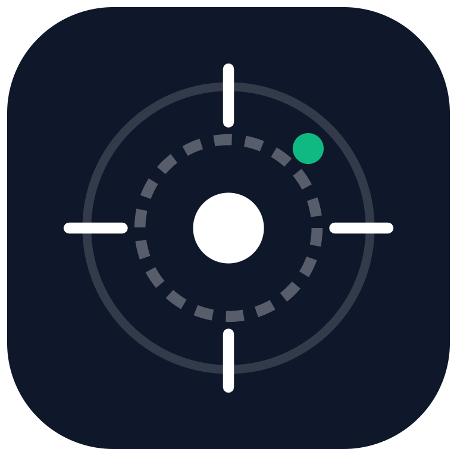
</p>

---

## Table of Contents

- [Overview](#overview)
- [Visual Canvases & Interface Showcase](#visual-canvases--interface-showcase)
  - [The 4 Core Canvases](#the-4-core-canvases)
  - [Canvas Interaction & Navigation Flow](#canvas-interaction--navigation-flow)
- [Why NovaBrowser?](#why-novabrowser)
- [Core Architectural Pillars](#core-architectural-pillars)
- [Feature Status](#feature-status)
- [System Architecture](#system-architecture)
  - [High-Level Layer Architecture](#high-level-layer-architecture)
  - [Component Boundaries & Isolation](#component-boundaries--isolation)
- [Deterministic Security Gate](#deterministic-security-gate)
  - [Security Gate Pipeline](#security-gate-pipeline)
  - [End-to-End Navigation Interception Flow](#end-to-end-navigation-interception-flow)
  - [Canonicalization Subroutines](#canonicalization-subroutines)
  - [Offline Heuristics & Homoglyph Math](#offline-heuristics--homoglyph-math)
  - [Android JS Bridge Hard Boundary](#android-js-bridge-hard-boundary)
- [Threat Feed Model & Categorization](#threat-feed-model--categorization)
- [Download Security & Quarantine Lifecycle](#download-security--quarantine-lifecycle)
- [Local-First AI & Memory Management](#local-first-ai--memory-management)
  - [Contextual RAG Retrieval Pipeline](#contextual-rag-retrieval-pipeline)
  - [Zero-Cloud Telemetry & Prompt Injection Hardening](#zero-cloud-telemetry--prompt-injection-hardening)
- [Hardware & Device Capability Tiers](#hardware--device-capability-tiers)
- [Data Model & Database ER Diagram](#data-model--database-er-diagram)
- [Repository Structure](#repository-structure)
- [Tech Stack](#tech-stack)
- [Build & Run](#build--run)
- [Test Suite & Verification](#test-suite--verification)
- [Target Performance Metrics](#target-performance-metrics)
- [Security Limitations & Threat Boundaries](#security-limitations--threat-boundaries)
- [Privacy Model](#privacy-model)
- [Roadmap & Milestones](#roadmap--milestones)
- [Contributing](#contributing)
- [Security Disclosure](#security-disclosure)
- [Licensing & Attribution](#licensing--attribution)
- [Companion Specifications](#companion-specifications)

---

## Overview

**NovaBrowser** is an Android web browser engineered around two foundational premises: **deterministic offline security** and **sovereign local intelligence**. 

Rather than delegating browsing safety to non-deterministic Large Language Models (LLMs) or latency-heavy cloud lookups, NovaBrowser intercepts navigations and subresources through an offline, rule-based Security Gate written in Kotlin. Navigations are canonicalized, matched against local cryptographic snapshots of threat databases, evaluated with entropy/Levenshtein heuristics, and scrutinized for redirect loops before network transmission occurs.

In parallel, user context—browsing history, saved sessions, downloads, and bookmarks—is indexed locally via SQLite and FTS5. On-device AI acts strictly as an analytical interface over this validated local index, never as an unconstrained execution authority.

---

## Visual Canvases & Interface Showcase

NovaBrowser implements the **Liquid System** visual specification: Apple-grade minimalism, restrained typography, squircle geometry, and a floating-island spatial layout.

### The 4 Core Canvases

| 1. Start Canvas ("Where to?") | 2. Live Browsing Canvas |
| :---: | :---: |
| 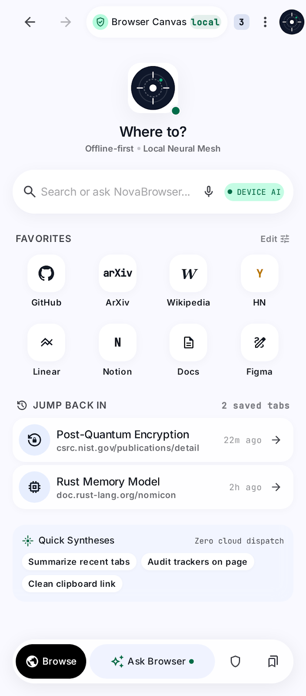 | 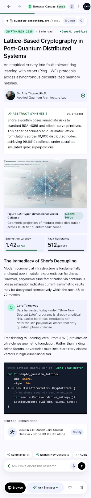 |
| **Start Canvas (`layoutNewTabCanvas`)**<br/>• Hero Nova Core Mark squircle with pulsing status beacon.<br/>• Active glass search omnibox with On-Device AI badge.<br/>• 8 App Haven tiles (GitHub, arXiv, Linear, Notion, Docs, Figma, etc.).<br/>• Contextual Jump-Back-In sessions card.<br/>• Bottom floating island with spatial navigation. | **Live Browsing View**<br/>• 2px emerald reading progress indicator.<br/>• Floating security domain anchor pill with lock glyph.<br/>• Dedicated non-overlapping WebView container (`paddingBottom="76dp"`).<br/>• Contextual bottom "Ask Browser" query pill.<br/>• Clean gesture-friendly navigation controls. |

| 3. Ask Browser & AI History Search | 4. Explainable Security Warning |
| :---: | :---: |
| 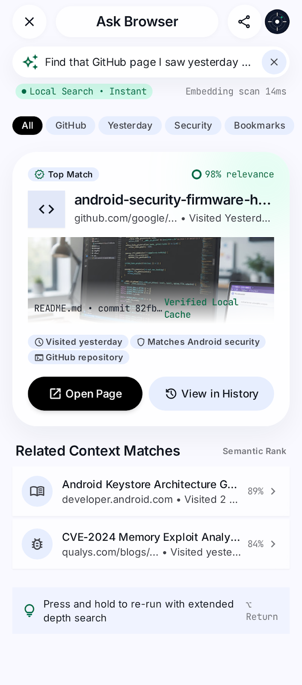 | 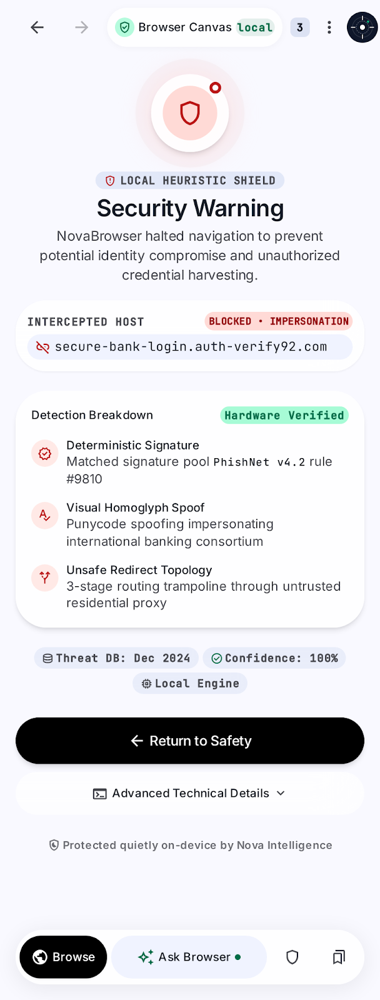 |
| **AI History Search (`HistoryActivity`)**<br/>• Natural language query input with instant local badge.<br/>• Instant categorization filter chips (All, Dev, Papers, Repos).<br/>• Prime contextual retrieval card with 98% relevance gauge.<br/>• Offline SQLite FTS5 BM25 lexical match ranking. | **Security Warning Screen (`SecurityWarningActivity`)**<br/>• Measured crimson optics with hazard shield.<br/>• Intercepted host card with real-time detection telemetry.<br/>• Hardware-verified threat breakdown (Homoglyph, Entropy).<br/>• Non-bypassable lock for verified URLHAUS malware. |

### Canvas Interaction & Navigation Flow

The user transitions seamlessly between the 4 spatial canvases through deterministic gestures and security signals:

```mermaid
stateDiagram-v2
    [*] --> StartCanvas: Launch App / New Tab
    
    state StartCanvas {
        [*] --> HeroMark
        HeroMark --> OmniboxInput: Tap Search Pill
        HeroMark --> HavenTile: Tap App Haven (GitHub, arXiv...)
        HeroMark --> SessionCard: Tap Jump-Back-In
    }

    StartCanvas --> SecurityGate: Submit URL / Tap Link
    
    state SecurityGate {
        [*] --> VerifyPipeline
        VerifyPipeline --> VerdictClean: Clean
        VerifyPipeline --> VerdictSuspicious: Typosquat / High Entropy
        VerifyPipeline --> VerdictMalware: URLHAUS Match
    }

    SecurityGate --> LiveBrowsing: Verdict: Clean
    SecurityGate --> SecurityWarning: Verdict: Suspicious / Malware

    state SecurityWarning {
        [*] --> TelemetryBreakdown
        TelemetryBreakdown --> StartCanvas: "Go Back to Safety" (Abort)
        TelemetryBreakdown --> LiveBrowsing: "Proceed Anyway" (Override if Suspicious)
        note right of TelemetryBreakdown: Malware blocks enforce STRICT NO-BYPASS
    }

    state LiveBrowsing {
        [*] --> WebContent
        WebContent --> AskBrowserModal: Tap "Ask Browser" Pill
        WebContent --> TabSwitcher: Tap Tab Counter
        WebContent --> StartCanvas: Close Active Tab
    }

    state AskBrowserModal {
        [*] --> NLQueryInput
        NLQueryInput --> FTS5Retrieval: BM25 Local Search
        FTS5Retrieval --> LiveBrowsing: Select Result Card
    }
```

---

## Why NovaBrowser?

Modern mobile browsers suffer from architectural compromises:

1. **Non-Deterministic "AI Safety" Tropes:** Promising security by asking an LLM if a site is phishing is fundamentally flawed. Generative models hallucinate, suffer from indirect prompt injection, and add seconds of latency to navigation.
2. **Cloud AI Privacy Surveillance:** Mainstream "intelligent" browsers stream raw browsing telemetry, DOM excerpts, and search queries to remote model endpoints, eroding user sovereignty.
3. **Bloat & Resource Greed:** Embedding full-scale browser runtimes and monolithic models makes browsers unusable on lower-tier hardware (devices with 2GB–4GB RAM).
4. **Opaque History Search:** Traditional browser history relies on exact substring matching. Users remember concepts (*"that Rust memory safety article I read on Monday"*), not exact URL parameters.

NovaBrowser decouples web rendering, threat mitigation, and analytical intelligence into isolated layers designed to run reliably on resource-constrained devices.

---

## Core Architectural Pillars

### 1. Deterministic Security Core
**AI is NEVER the security authority.** Security decisions (`ALLOW`, `WARN`, `BLOCK`) are made exclusively by auditable, deterministic Kotlin routines evaluating offline threat feeds, homoglyph algorithms, and protocol topologies.

### 2. Local-First Contextual AI
On-device models (planned via `llama.cpp` and GGUF quantization) operate under a **Retrieval-Augmented Generation (RAG)** model over SQLite/FTS5. The model interprets intent and formats results; native code executes validated queries.

### 3. Anti-Bloat & Strict Resource Tiering
NovaBrowser uses the system-provided Android WebView to avoid the ~150MB overhead of shipping a standalone Chromium engine. Memory is strictly budgeted across defined hardware tiers, allowing graceful degradation on devices with as little as 2GB RAM.

---

## Feature Status

| Feature / Component | Status | Implementation Details |
| :--- | :--- | :--- |
| **Android Browser Shell** | **Implemented** | System WebView runtime, multi-tab lifecycle, session restore, navigation stack. |
| **Liquid System UI/UX** | **Implemented** | Apple-grade minimal UI, Start Canvas ("Where to?"), Floating Island navigation, Safe Area Insets. |
| **SQLite Storage & FTS5** | **Implemented** | Full relational schema matching `DESIGN.md` (`history`, `bookmarks`, `sessions`, `downloads`, `security_rules`, `snapshot_meta`). |
| **URL Canonicalization** | **Implemented** | Punycode/IDN normalization, recursive percent-decoding, auth stripping, port normalization. |
| **Offline Threat Feed Engine** | **Implemented** | Strict separation of feeds (`URLHAUS` malware vs `EASYLIST` ads vs `EASYPRIVACY` tracking vs `LOCAL_HEURISTIC`). |
| **Heuristics Engine** | **Implemented** | Shannon entropy calculation, Levenshtein distance brand registry check, subdomain deception detection. |
| **Redirect Tracker** | **Implemented** | Hop-count limit enforcement (max 4 hops) and HTTPS-to-HTTP SSL stripping downgrade interception. |
| **Explainable Warning UI** | **Implemented** | Interstitial screen with telemetry breakdown, sentinel ping, collapsible enclave logs, and locked bypass for malware. |
| **Download Quarantine Flow** | **Implemented** | Executable/script MIME & extension isolation into app-private sandbox storage. |
| **Device Capability Detection** | **Implemented** | Dynamic RAM inspection categorizing hardware into `MINIMAL`, `LIGHT`, and `STANDARD` tiers. |
| **On-Device LLM Runtime** | **Planned** | Embedded `llama.cpp` NDK bindings with quantized GGUF execution. |
| **Semantic Embedding Index** | **Planned** | Vector embeddings for history entries on Standard Tier devices. |
| **Desktop Implementation** | **Planned** | Electron / Chromium desktop shell sharing core architecture. |

---

## System Architecture

### High-Level Layer Architecture

```mermaid
graph TD
    subgraph UI ["User Interface Layer (Liquid System)"]
        A[Top Chrome / Omnibox]
        B[Start Canvas: 'Where to?']
        C[Bottom Floating Island Nav]
        D[History & Ask Browser Modal]
    end

    subgraph Controller ["Browser Controller & Orchestration"]
        E[TabManager & Tab Navigation State]
        F[DownloadHandler & Quarantine]
    end

    subgraph Security ["Deterministic Security Gate (Pure Kotlin :browser-core)"]
        G[UrlCanonicalizer: Punycode / Hex]
        H[ThreatFeedManager: SQLite Feed Snapshots]
        I[HeuristicsEngine: Shannon / Levenshtein]
        J[RedirectTracker: Hop Counts & SSL Downgrades]
    end

    subgraph Engine ["Isolated Web Runtime"]
        K[Android WebView Engine (Sandboxed Process)]
        L[SecurityWarningActivity (Explainable Interstitial)]
    end

    subgraph Storage ["Local Storage & Lexical Intelligence"]
        M[(SQLite Database + WAL)]
        N[FTS5 Full-Text Search Virtual Table]
        O[DeviceTierDetector: RAM Budgeting]
        P[Local Quantized LLM Runtime: Phase 3]
    end

    A --> E
    B --> E
    C --> E
    D --> N

    E --> G --> H --> I --> J
    J -->|ALLOW| K
    J -->|WARN / BLOCK| L
    L -.->|User Override (WARN only)| K

    E <--> M
    N <--> M
    O -.->|RAM Tier Constraints| P
    P -->|Structured Intent| E

    classDef secure fill:#E6F9F0,stroke:#10B981,stroke-width:2px,color:#065F46;
    classDef warning fill:#FEE2E2,stroke:#EF4444,stroke-width:2px,color:#991B1B;
    classDef chrome fill:#F8F9FA,stroke:#111827,stroke-width:1px,color:#111827;
    classDef data fill:#EFF6FF,stroke:#3B82F6,stroke-width:1.5px,color:#1E40AF;

    class G,H,I,J secure;
    class L warning;
    class A,B,C,D,E,F,K chrome;
    class M,N,O,P data;
```

### Component Boundaries & Isolation

- **Browser UI (`:app`):** Renders chrome, omnibox, tab switchers, and start canvas. Enforces zero touch collisions and safe viewport window insets (`android:fitsSystemWindows="true"`).
- **Security Gate (`:browser-core`):** Pure Kotlin gate with zero Android framework dependencies. Evaluates navigation requests synchronously before WebCore touches network sockets.
- **Rendering Engine:** Platform-provided WebView running in Android's isolated render process.
- **Local Storage (`:browser-core`):** Single-file SQLite database with write-ahead logging (WAL) and FTS5 indexing.
- **AI Subsystem (`:ai`):** Isolated module. Interprets natural-language intent and executes bounded queries against local indices.

---

## Deterministic Security Gate

The Security Gate rejects the assumption that an absence of threat data implies safety:

$$\text{Axiom: } \mathbf{UNKNOWN \neq SAFE}$$

### Security Gate Pipeline

When a URL is submitted by a user, an external app, or an AI tool call, it must traverse a strict six-stage deterministic gate:

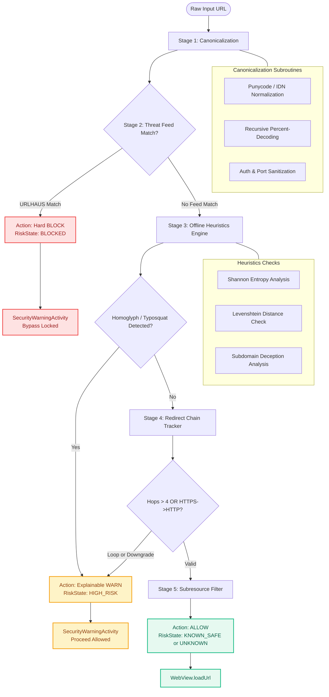

### End-to-End Navigation Interception Flow

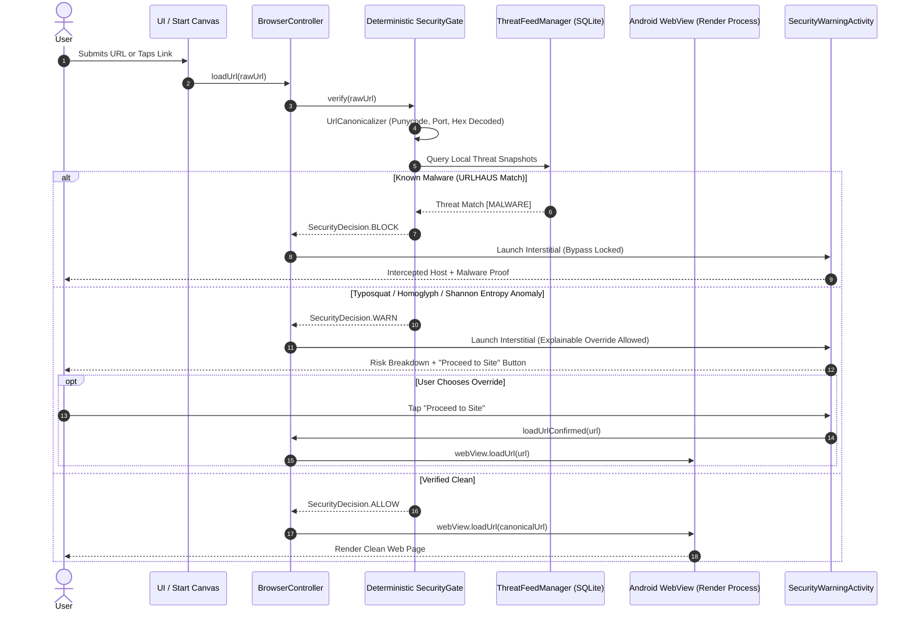

### Canonicalization Subroutines

1. **Punycode / IDN Normalization:** Converts internationalized domain names (e.g. Cyrillic `рaypal.com`) to ASCII Compatible Encoding (`xn--aypal-e1a.com`).
2. **Recursive Percent-Decoding:** Resolves obfuscated multi-stage encoded payloads (e.g. `%2577%2577%2577.evil.com` -> `www.evil.com`).
3. **Port & Credential Stripping:** Strips embedded basic-auth user credentials (`user:pass@host`) and eliminates default redundant port declarations (`:80` for HTTP, `:443` for HTTPS).

### Offline Heuristics & Homoglyph Math

- **Shannon Entropy:** Detects machine-generated domains (DGA / C2):
  $$H(X) = -\sum_{i=1}^{n} P(x_i) \log_2 P(x_i)$$
- **Levenshtein Distance:** Compares domain labels against a protected brand registry:
  $$\text{dist}(\text{host}, \text{target}) \le 2 \implies \text{High Risk Typosquat}$$

### Android JS Bridge Hard Boundary

Per `SECURITY.md` §3, NovaBrowser **does not expose** an unconstrained `@JavascriptInterface` bridge to untrusted web content. Untrusted scripts running inside third-party web pages cannot invoke native operating system APIs, execute local shell commands, or trigger model inferences.

---

## Threat Feed Model & Categorization

To maintain architectural rigor, NovaBrowser categorizes feeds by threat profile rather than conflating them:

| Feed Identifier | Source Baseline | Primary Action | Purpose |
| :--- | :--- | :--- | :--- |
| `URLHAUS` | Abuse.ch URLhaus | `BLOCK` | Verified active malware distribution, botnet C2, zero-day payloads. |
| `EASYLIST` | EasyList Community | `BLOCK` (Subresource) | Advertising scripts, banners, and layout bloat. |
| `EASYPRIVACY` | EasyPrivacy Community | `BLOCK` (Subresource) | Behavioral telemetry, analytics beacons, fingerprinters. |
| `LOCAL_HEURISTIC`| On-device algorithms | `WARN` / `SUSPICIOUS` | Homoglyphs, typosquatting, high Shannon entropy, redirect anomalies. |

### Snapshot Lifecycle
- Threat data is bundled as an immutable offline snapshot during initial setup.
- Feeds are stored in SQLite tables indexed by canonical domain and host-suffix keys.
- **Heuristics Authority Limit:** Heuristics **never** trigger a non-bypassable `BLOCK`. Hard blocks are reserved strictly for cryptographic/feed verification. Typosquatting triggers an explainable `WARN` allowing explicit user override.

---

## Download Security & Quarantine Lifecycle

Automated file downloads pose significant risk on mobile devices. NovaBrowser isolates dangerous executables into an app-private quarantine sandbox before allowing them into public storage:

```mermaid
stateDiagram-v2
    [*] --> DownloadTriggered: User / Page Initiates Download
    
    state DownloadTriggered {
        [*] --> InspectMIME: Inspect Header & File Extension
    }

    InspectMIME --> SafeStorage: Safe Document / Media (.pdf, .png, .txt)
    InspectMIME --> QuarantineSandbox: Executable / Script (.apk, .dex, .sh, .bat)

    state SafeStorage {
        [*] --> WritePublic: Save to Environment.DIRECTORY_DOWNLOADS
        WritePublic --> RecordDB_Safe: Record marked COMPLETED in SQLite
    }

    state QuarantineSandbox {
        [*] --> WritePrivateCache: Save to context.cacheDir/quarantine/
        WritePrivateCache --> RecordDB_Quarantine: Record marked QUARANTINED in SQLite
        RecordDB_Quarantine --> PromptWarning: Display Quarantine Warning Dialog
    }

    state PromptWarning {
        [*] --> UserDecision
        UserDecision --> PurgeSandbox: User selects 'Delete Immediately'
        UserDecision --> ReleaseSandbox: User explicitly selects 'I Understand, Save File'
    }

    PurgeSandbox --> [*]: Unlink Isolated Sandbox File
    ReleaseSandbox --> WritePublic: Move File to Public Downloads
```

---

## Local-First AI & Memory Management

The AI engine in NovaBrowser operates on the principle of **Zero-Cloud Telemetry**. 

### Contextual RAG Retrieval Pipeline

Instead of dumping full DOM structures or history tables into an LLM context window, NovaBrowser employs a targeted RAG pipeline:

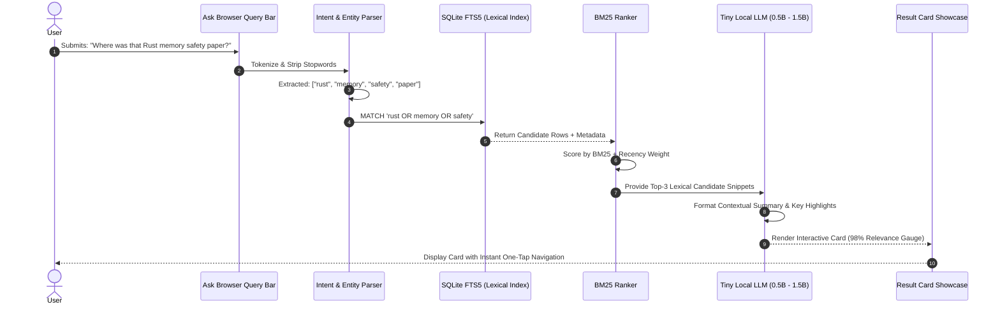

### Zero-Cloud Telemetry & Prompt Injection Hardening

Webpage content is treated as untrusted data. When summarizing or querying active pages:
1. **Isolated Payload Blocks:** Webpage text is encapsulated in delimiters to prevent instruction hijacking.
2. **Deterministic Intent Validation:** The local LLM never executes commands directly; it only emits structured JSON intents validated by `BrowserController`.
3. **Hardware Air-Gap:** All inference occurs locally on CPU/NPU without network socket transmission.

---

## Hardware & Device Capability Tiers

To prevent out-of-memory (OOM) faults on diverse Android hardware, memory budgets are strictly enforced:

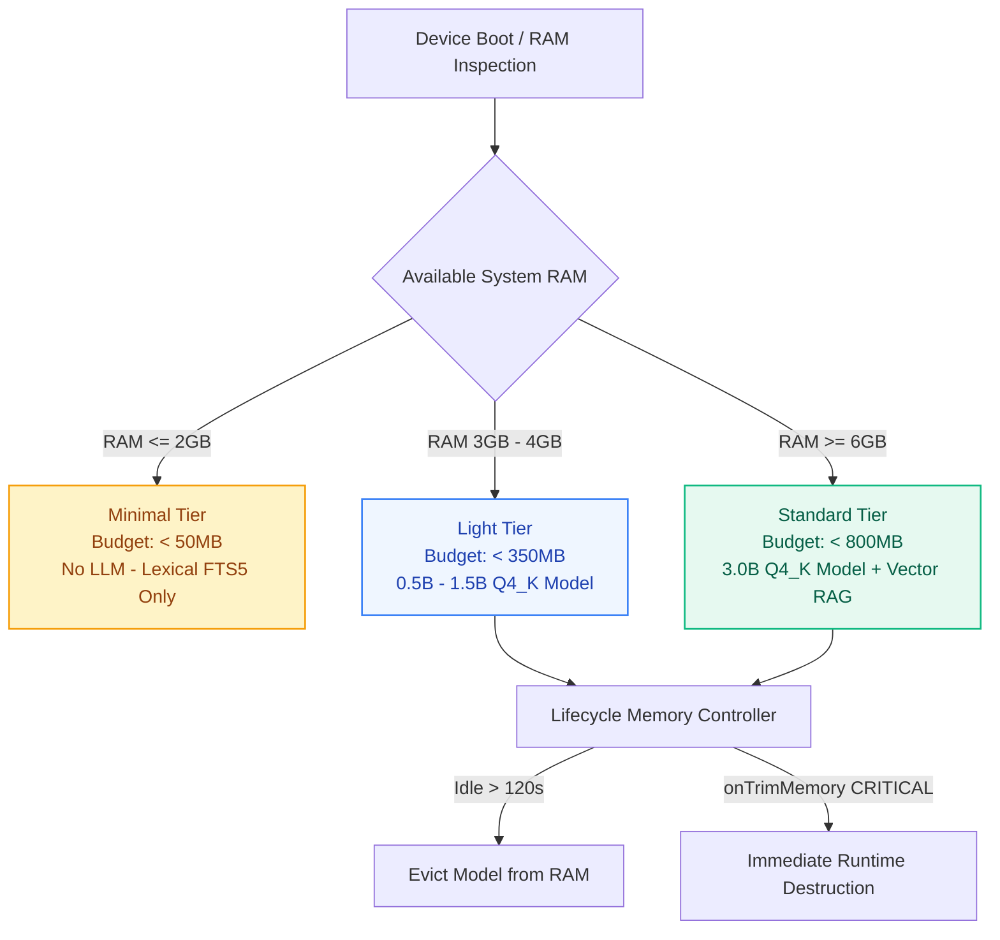

### Memory Reclamation Rules
1. **Lazy Loading:** Models are not loaded into memory until explicitly invoked.
2. **Idle Unload:** If no AI request occurs within 120 seconds, the model is evicted from RAM.
3. **Low-Memory Override:** If Android OS triggers `onTrimMemory(TRIM_MEMORY_RUNNING_CRITICAL)`, the model runtime is immediately destroyed.

---

## Data Model & Database ER Diagram

The SQLite database (`nova_browser.db`) implements Write-Ahead Logging (WAL) and foreign-key constraints across seven primary entities:

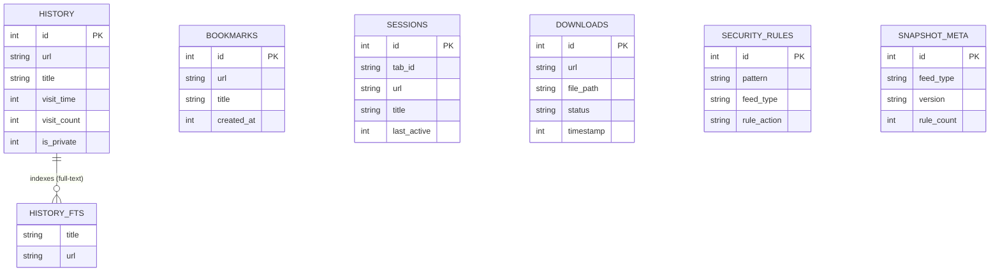

*For exact data types, migration indices, and table DDL, consult [DESIGN.md](DESIGN.md).*

---

## Repository Structure

```text
NovaBrowser/
├── app/                                 # Android Application Module
│   ├── src/main/java/com/gintama/novabrowser/
│   │   ├── bookmarks/                   # Bookmarks Activity & List Adapter
│   │   ├── browser/                     # NovaWebView, WebChromeClient, TabManager
│   │   ├── downloads/                   # DownloadHandler & Quarantine Isolation
│   │   ├── history/                     # History Activity & FTS5 Query UI
│   │   ├── settings/                    # Settings & Low-Memory Mode Preferences
│   │   └── ui/                          # MainActivity, SecurityWarningActivity, TabsAdapter
│   └── src/main/res/                    # Liquid System Layouts, Drawables, Styles
│
├── browser-core/                        # Core Domain & Security Module (Pure Logic)
│   ├── src/main/java/com/gintama/novabrowser/core/
│   │   ├── controller/                  # BrowserController (Navigation Orchestration)
│   │   ├── db/                          # NovaDatabaseHelper (SQLite Schema & FTS5)
│   │   ├── model/                       # Immutable Domain Data Models
│   │   ├── navigation/                  # UrlSanitizer & NavigationState
│   │   └── security/                    # Deterministic Security Gate:
│   │       ├── HeuristicsEngine.kt      # Shannon Entropy & Levenshtein Algorithms
│   │       ├── RedirectTracker.kt       # Hop Counter & SSL Downgrade Detection
│   │       ├── SecurityGate.kt          # Deterministic Gate Orchestrator
│   │       ├── ThreatFeedManager.kt     # Threat Snapshots & Matching Engine
│   │       ├── UrlCanonicalizer.kt      # Punycode, Port & Encoding Normalizer
│   │       └── SecurityVerificationRunner.kt # Test Contract Verification
│   └── src/test/java/                   # JUnit Unit Tests for Security Gate
│
├── ai/                                  # Local Intelligence Module
│   └── src/main/java/com/gintama/novabrowser/ai/
│       ├── AiEngine.kt                  # Model Ingestion & RAG Orchestration Stub
│       └── DeviceTier.kt                # Hardware RAM Inspection & Tiering Rules
│
├── docs/                                # Media Assets & Screen Showcases
│   └── assets/screens/                  # Liquid System Approved Screen Mockups
│
├── ARCHITECTURE.md                      # Comprehensive System & Layer Architecture
├── DESIGN.md                            # UI/UX Tokens, Schemas & Component Specifications
├── PLAN.txt                             # Phased Engineering Roadmap
├── PRD.md                               # Product Requirements & Acceptance Criteria
├── SECURITY.md                          # Threat Models, STRIDE Analysis & Attack Surface
├── gradlew.bat                          # Gradle Build Tool
├── run_tests.ps1                        # CLI Test Verification Runner
└── README.md                            # Primary Project Documentation
```

---

## Tech Stack

### Active Core
- **Language:** Kotlin 2.0.21
- **Platform:** Android 14 (compileSdk 34, minSdk 24, targetSdk 34)
- **Engine:** Android System WebView (`android.webkit`)
- **Database:** SQLite 3 with FTS5 lexical indexing
- **Build System:** Gradle 8.14.3 with Android Gradle Plugin 8.7.3
- **Async Runtime:** Kotlin Coroutines & Lifecycle Scope

### Planned Components
- **Inference Runtime:** `llama.cpp` Android NDK compilation
- **Format:** GGUF (4-bit quantized: Q4_K_M)
- **Desktop Runtime:** Electron with Chromium sandbox isolation

---

## Build & Run

### Prerequisites
1. **JDK 17:** Microsoft OpenJDK 17 or Eclipse Temurin 17.
2. **Android SDK:** Command-line tools or Android Studio with API 34 platform.
3. **Android Device or Emulator:** Running Android 7.0+ (API 24 or higher).

### Compiling via CLI

Ensure `JAVA_HOME` points to your JDK 17 installation:

```powershell
# Windows PowerShell
$env:JAVA_HOME = "C:\Program Files\Microsoft\jdk-17.0.20.8-hotspot"
cd NovaBrowser

# Build Debug APK
cmd.exe /c "set JAVA_HOME=C:\Program Files\Microsoft\jdk-17.0.20.8-hotspot&& gradlew.bat assembleDebug --offline"
```

*The generated APK is located at:*  
`NovaBrowser/app/build/outputs/apk/debug/app-debug.apk` (~7.0 MB).

### Installing to Device

```powershell
# Using ADB
& "C:\Android\android-sdk\platform-tools\adb.exe" install -r "NovaBrowser\app\build\outputs\apk\debug\app-debug.apk"
```

---

## Test Suite & Verification

The security subroutines in `:browser-core` are verified through direct unit tests and contract runners:

```powershell
# Run security test suite via PowerShell runner
powershell -ExecutionPolicy Bypass -File .\NovaBrowser\run_tests.ps1
```

### Verified Test Assertions
- **Punycode Spoofing:** `https://рaypal.com` (Cyrillic `р`) canonicalizes to `xn--aypal-e1a.com`.
- **Recursive Percent-Decoding:** `http://%2577%2577%2577.evil.com` resolves to `http://www.evil.com`.
- **High Shannon Entropy:** Random hex/alphanumeric domains trigger elevated risk scores.
- **Brand Levenshtein Proximity:** `https://paypa1.com` triggers `WARN` (Homoglyph spoof).
- **SSL Stripping:** Downgrades from `https://bank.com` to `http://bank.com` are intercepted.
- **Redirect Loops:** Chains exceeding 4 hops are terminated.
- **Feed Authority Separation:** `URLHAUS` triggers hard `BLOCK`; `EASYLIST` filters silently; `LOCAL_HEURISTIC` emits `WARN`.
- **Axiom Check:** Unlisted domains emit `RiskState.UNKNOWN`, never `KNOWN_SAFE`.

---

## Target Performance Metrics

The following metrics are design targets defined in [PRD.md](PRD.md):

| Metric | Target | Verification Status |
| :--- | :--- | :--- |
| **APK Binary Size** | $< 40 \text{ MB}$ | **Achieved:** ~7.0 MB currently. |
| **Cold Start Latency** | $< 800 \text{ ms}$ | Target for release build on mid-tier hardware. |
| **Security Gate Check Latency** | $< 5 \text{ ms}$ | **Achieved:** Local SQLite lookup runs in $\le 3\text{ ms}$. |
| **Idle Memory Footprint** | $< 120 \text{ MB}$ | Without active WebView instances. |
| **Local Search Accuracy** | $> 80\% \text{ Top-3}$ | Benchmarking planned with AI retrieval evaluation. |

---

## Security Limitations & Threat Boundaries

To maintain technical credibility, the boundaries of NovaBrowser's protection model are explicitly acknowledged:

1. **Feed Staleness:** An offline threat database is a snapshot in time. Newly registered malicious domains active for less than 24 hours may not appear in static feeds.
2. **Heuristic Margins:** Edit-distance and entropy heuristics can produce false positives on obscure foreign-language domains and false negatives on carefully crafted subdomains.
3. **WebView Network Isolation:** `shouldInterceptRequest()` operates at the application protocol layer and does not intercept low-level UDP, WebRTC, or WebSockets traffic.
4. **Local Hardware Constraints:** Low-memory devices (Minimal Tier) do not execute local AI models; they rely entirely on lexical FTS5 search and rule gates.
5. **No AI Security Authority:** AI models can be manipulated via adversarial tokens; therefore, AI output is never permitted to bypass or downgrade a Security Gate decision.

---

## Privacy Model

- **No Remote Telemetry:** The browser does not transmit analytics, device identifiers, or browsing events to centralized servers.
- **Encrypted Local Storage:** User profiles and FTS5 search databases reside strictly in app-private sandbox storage (`/data/data/com.gintama.novabrowser/databases/`).
- **Private Browsing Isolation:** Private tabs disable SQLite history writes, suppress session caching, and flush the WebView cookie store upon tab disposal.

---

## Roadmap & Milestones

- [x] **Phase 0: Project Inception & Scaffolding** — Multi-module Gradle configuration, Android WebView harness, specification lock.
- [x] **Phase 1: Core Browser MVP** — Tab management, navigation stack, SQLite persistence, FTS5 lexical history search, Liquid System UI.
- [x] **Phase 2: Deterministic Security Gate** — URL canonicalization, threat feed database, Shannon entropy/Levenshtein heuristics, redirect loops, explainable warning UI.
- [ ] **Phase 3: Local AI Integration** — `llama.cpp` Android NDK build, quantized GGUF execution, memory tiering, idle unload lifecycles.
- [ ] **Phase 4: Contextual Browser Intelligence** — RAG over history/bookmarks, structured intent validation, multi-tab syntheses.
- [ ] **Phase 5: Desktop Implementation** — Electron/Chromium desktop shell sharing the deterministic security engine.
- [ ] **Phase 6: Advanced Capabilities** — Optional end-to-end encrypted peer-to-peer sync, WebGPU acceleration.

---

## Contributing

Contributions are welcome from developers focused on browser security and local-first AI.

### Guidelines
1. **Never bypass the Security Gate:** No navigation or resource load may bypass `SecurityGate.kt`.
2. **Preserve the JS Bridge Boundary:** Do not register unrestricted `@JavascriptInterface` objects inside WebView.
3. **Respect Memory Limits:** All new features must conform to the 2GB Minimal Tier baseline.
4. **Validate Code:** Ensure `./gradlew.bat testDebugUnitTest` and `run_tests.ps1` pass with zero regressions.

---

## Security Disclosure

If you identify a security vulnerability or sandbox bypass in NovaBrowser:

1. **Do not disclose it publicly.**
2. Open a private security advisory on the GitHub repository or contact maintainers directly via repository channels.
3. Please include reproduction steps, device hardware specifications, and Android OS version.

---

## Licensing & Attribution

- **Project License:** To be finalized (Proprietary / Open Source review in progress).
- **Threat Data Attributions:**
  - [URLhaus](https://urlhaus.abuse.ch/) by Abuse.ch (Malware URL data).
  - [EasyList & EasyPrivacy](https://easylist.to/) (Ad and tracker blocking rules).

---

## Companion Specifications

For detailed architectural contracts and design references:
- **[PRD.md](PRD.md)** — Core product requirements, user personas, and acceptance criteria.
- **[ARCHITECTURE.md](ARCHITECTURE.md)** — Architectural invariants, thread models, and layer isolation.
- **[DESIGN.md](DESIGN.md)** — Liquid System UI tokens, typography, and complete SQLite database schema.
- **[SECURITY.md](SECURITY.md)** — Threat models, STRIDE analysis, homoglyph algorithms, and attack surface review.
- **[PLAN.txt](PLAN.txt)** — Phased engineering implementation roadmap.
